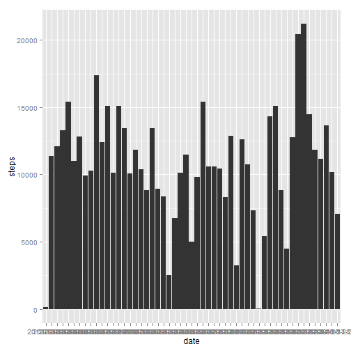
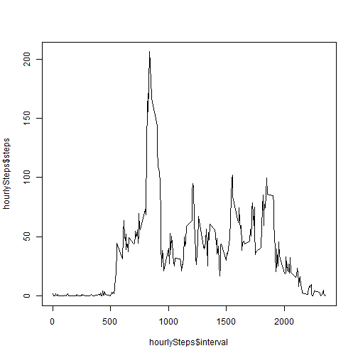
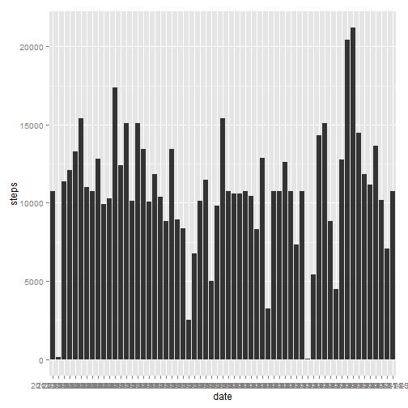
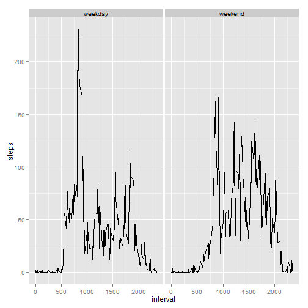

## Reproducible Research / Peer Assignment 1 / December 2014

### Loading and preprocessing the data


Create a temporary file, download the zip file to it, extract activity.csv, read, and clean.


```r
library(utils)
temp <- tempfile()
setInternet2(use=TRUE)
download.file("https://d396qusza40orc.cloudfront.net/repdata%2Fdata%2Factivity.zip",destfile=temp)
dataRaw <- read.csv(unz(temp,"activity.csv"))
data <- dataRaw[complete.cases(dataRaw),]
```

### What is the mean total number of steps daken per day?

Aggregate the cleaned data by Date, and plot histogram


```r
library(ggplot2)
dailySteps <- aggregate(data$steps,by=list(data$date),FUN=sum)
colnames(dailySteps) <- c("date", "steps")
qplot(x=date, y=steps, data=dailySteps, geom="histogram", stat="identity")
```

 

Mean Daily Steps:


```r
mean(dailySteps$steps)
```

```
## [1] 10766.19
```

Median Daily Steps:


```r
median(dailySteps$steps)
```

```
## [1] 10765
```

### What is the average daily activity pattern?

Aggregate the cleaned data by Interval, and plot


```r
hourlySteps <- aggregate(data$steps,by=list(data$interval),FUN=mean)
colnames(hourlySteps) <- c("interval", "steps")
plot(hourlySteps$interval, hourlySteps$steps, type="l")
```

 

The 5 minute Interval containing on an average the maximum number of steps:

```r
hourlySteps[which.max(hourlySteps$step),]$interval
```

```
## [1] 835
```

### Imputing Missing Values

1. Number of rows with missing values:


```r
nrow(dataRaw[is.na(dataRaw$steps),])
```

```
## [1] 2304
```

Next, we merge the Raw Data with hourlySteps data, then we replace the missing values with the mean. To cleanup, drop the means column which was added during the merge. Then we aggregate again and plot.


```r
filledValues <- merge(dataRaw, hourlySteps,by="interval", all=TRUE)
filledValues[is.na(filledValues$steps.x),]$steps.x <- filledValues[is.na(filledValues$steps.x),]$steps.y
filledValues <- subset(filledValues,select=interval:date)
dailyStepsNew <- aggregate(filledValues$steps.x,by=list(filledValues$date),FUN=sum)
colnames(dailyStepsNew) <- c("date", "steps")
qplot(x=date, y=steps, data=dailyStepsNew, geom="histogram", stat="identity")
```

 

Mean Daily Steps:


```r
mean(dailyStepsNew$steps)
```

```
## [1] 10766.19
```

Median Daily Steps:


```r
median(dailyStepsNew$steps)
```

```
## [1] 10766.19
```

The mean will be the same, as we just added the mean value to the missing values. The median changes.

### Are there differences in activity patterns between weekdays and weekends?

Calculate new column for weekend or not, then aggregate by weekend and interval, and plot

```r
filledValues$weekdays <- weekdays(as.Date(filledValues$date))
filledValues[filledValues$weekdays=="Saturday",]$weekdays <- "weekend"
filledValues[filledValues$weekdays=="Sunday",]$weekdays <- "weekend"
filledValues[filledValues$weekdays!="weekend",]$weekdays <- "weekday"

hourlyStepsFilled <- aggregate(filledValues$steps.x,by=list(filledValues$interval,filledValues$weekdays),FUN=mean)
colnames(hourlyStepsFilled) <- c("interval", "weekday", "steps")
qplot(interval, steps, data=hourlyStepsFilled,facets = .~weekday, geom="line")
```

 

Yes, on weekday steps are higher during the early intervals, whereas on weekend they are higher during the middle intervals.

## Thank You!
